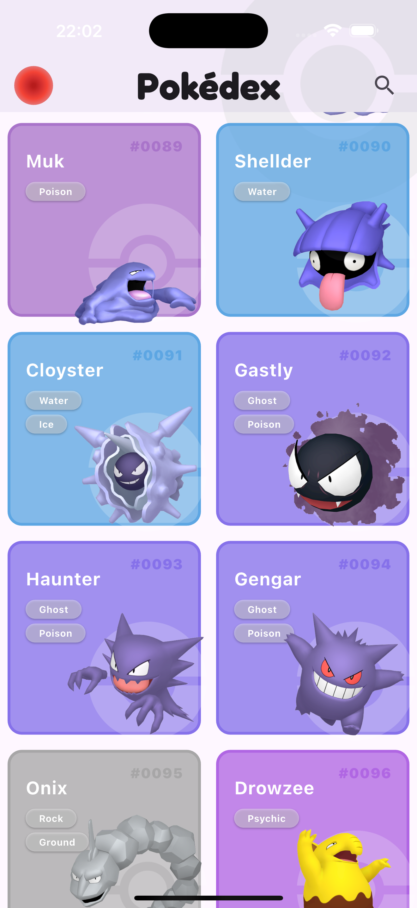
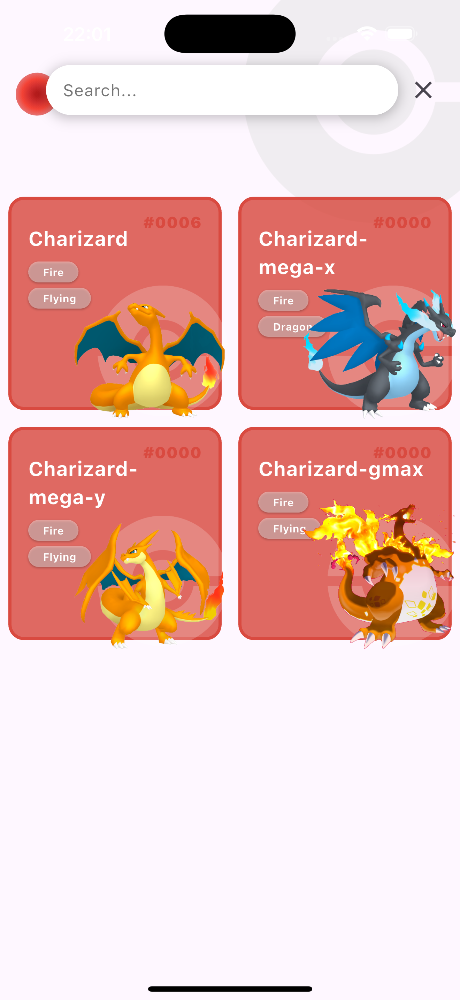
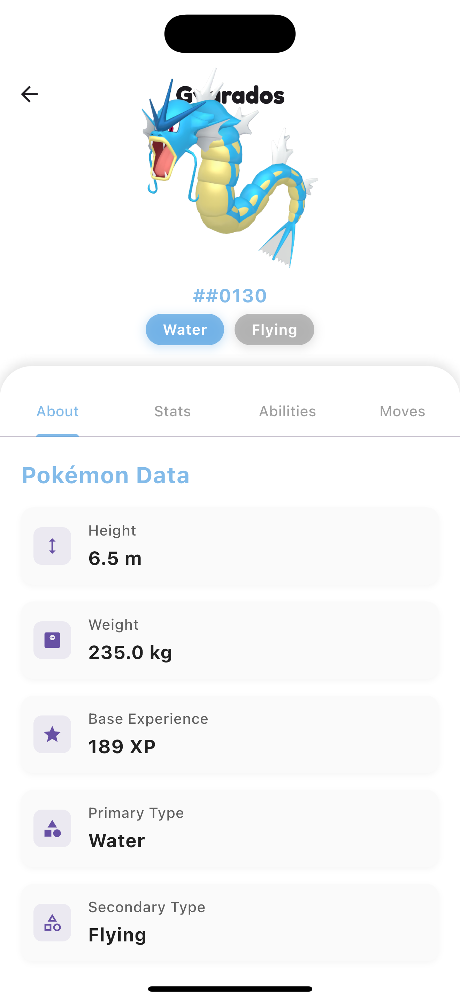
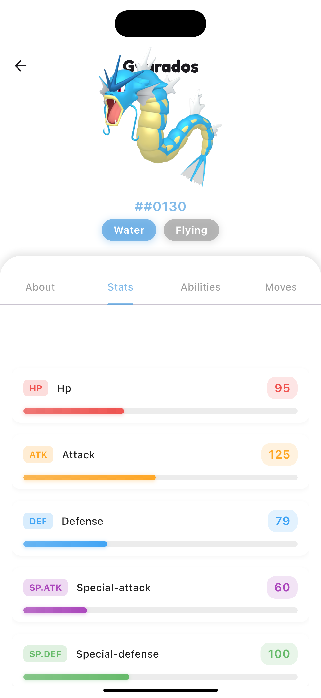
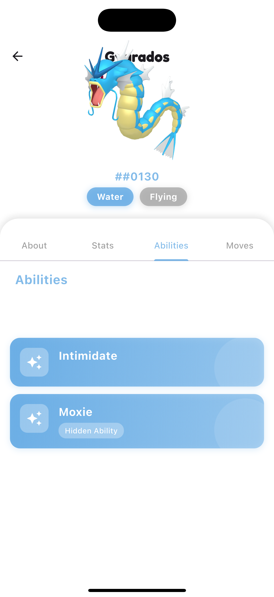
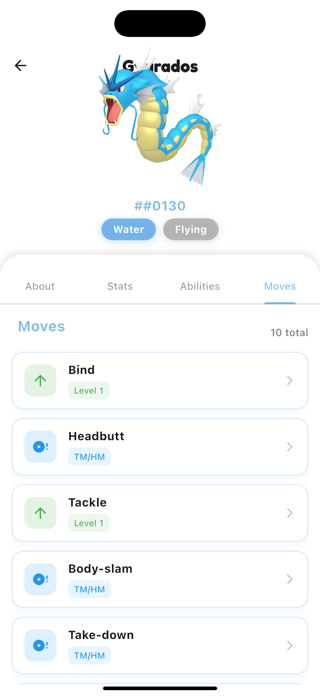
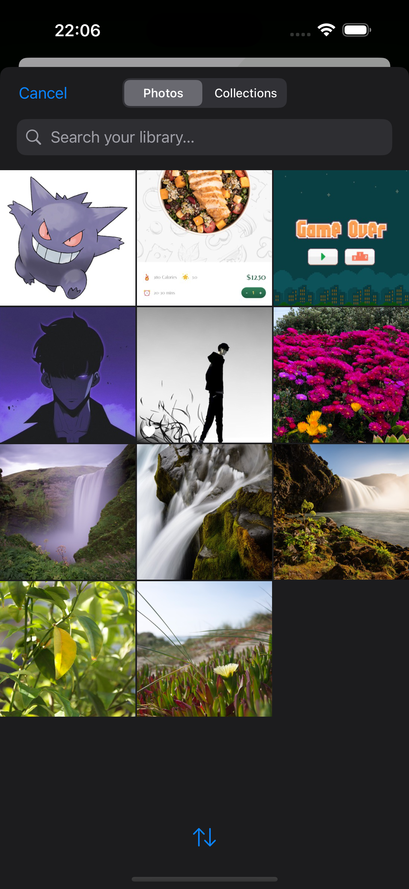
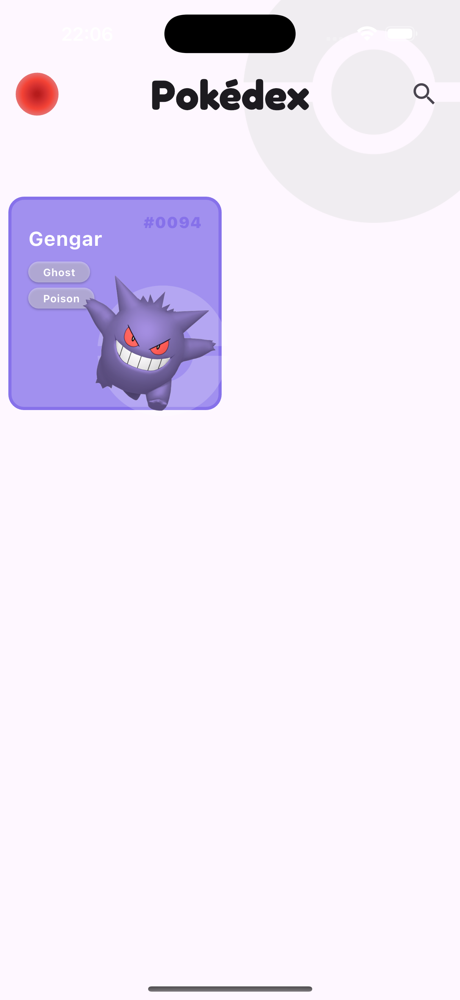
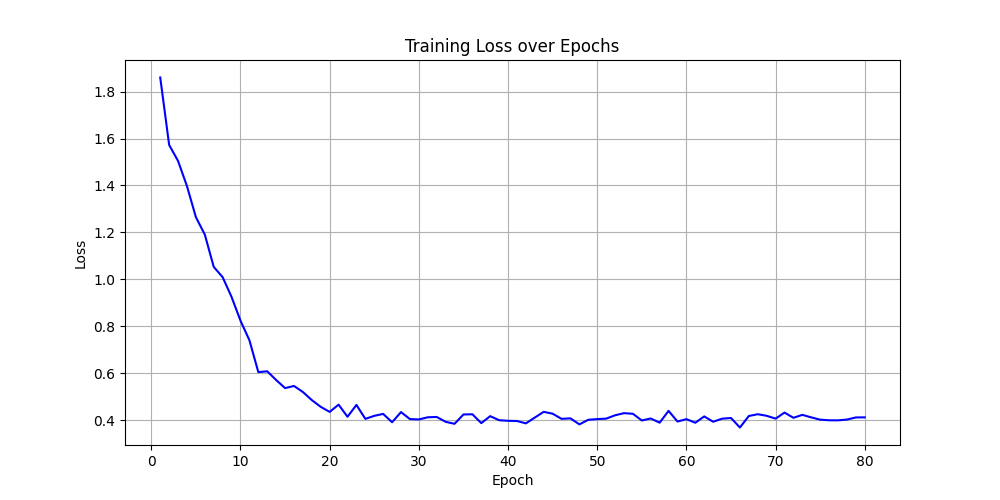

# 🔍 Pokédex Project

<div align="center">


[](https://flutter.dev/)
[](https://www.python.org/)
[](https://www.djangoproject.com/)
[](https://pytorch.org/)

</div>

A modern Pokédex application that combines Flutter for the frontend, Django for the backend, and PyTorch for image classification. Search for Pokémon, view detailed information, and identify Pokémon through image recognition.

## ✨ Features

- **🔍 Search Engine**: Find Pokémon by name with instant results
- **📊 Detailed Stats**: View comprehensive information about each Pokémon
- **🖼️ Image Classification**: Identify Pokémon using our trained AI model
- **🎨 Modern UI**: Beautiful, responsive interface with smooth animations
- **🔄 Real-time Data**: Powered by the OpenPokeAPI for accurate information

## 📱 Screenshots

<div align="center">
  <!-- Home & Search Screen -->
  <div style="display: flex; flex-direction: column; align-items: center;">
    <div style="flex: 2; padding: 10px;">
      <p><strong>Home & Search Screen</strong></p>
      <div style="display: flex; gap: 10px;">
        
        
      </div>
    </div>
    <!-- Pokemon Details Screen -->
    <div style="display: flex; align-items: flex-start; margin-top: 20px;">
      <div style="flex: 2; padding: 10px;">
        <p><strong>Pokemon Details Screen</strong></p>
        <div style="display: flex; gap: 10px;">
          
          
        </div>
      </div>
    </div>
    <!-- Pokemon List Screen -->
    <div style="display: flex; align-items: flex-start; margin-top: 20px;">
      <div style="flex: 2; padding: 10px;">
        <p><strong>Pokemon List Screen</strong></p>
        <div style="display: flex; gap: 10px;">
           
          
        </div>
      </div>
    </div>
    <!-- Pokemon Image Classification Screen -->
    <div style="display: flex; align-items: flex-start; margin-top: 20px;">
      <div style="flex: 2; padding: 10px;">
        <p><strong>Pokemon Image Classification Screen</strong></p>
        <div style="display: flex; gap:     10px;">
          
          
        </div>
      </div>
    </div>
  </div>
</div>

## 🧠 AI Model

The image classification model is currently trained to recognize these Pokémon:

|  Blastoise   |  Charizard  | Butterfree  |  Dragonite  |    Gengar    |
| :----------: | :---------: | :---------: | :---------: | :----------: |
| **Gyarados** | **Pikachu** | **Rhyhorn** | **Slowbro** | **Venusaur** |

<details>
<summary>View model training visualization</summary>
<div align="center">
  
</div>
</details>

## 🚀 Getting Started

### Prerequisites

- Python 3.8+
- Node.js
- Flutter SDK
- Dart SDK

### Backend Setup

1. Navigate to the backend directory:

   ```bash
   cd backend/pokedex_model_api
   ```

2. Install the required Python packages:

   ```bash
   pip install -r requirements.txt
   ```

3. Apply the database migrations:

   ```bash
   python manage.py migrate
   ```

4. Start the Django development server:
   ```bash
   python manage.py runserver
   ```

### Frontend Setup

1. Navigate to the frontend directory:

   ```bash
   cd frontend
   ```

2. Install the required Dart packages:

   ```bash
   flutter pub get
   ```

3. Run the Flutter application:
   ```bash
   flutter run
   ```

## 📦 Project Structure

```
pokedex/
├── frontend/         # Flutter application
│   └── lib/          # Dart source code
├── backend/          # Django server
│   └── pokedex_model_api/  # API endpoints and model serving
└── model/            # PyTorch model for classification
    └── src/          # Model definition and training
```

## 🌟 Key Features Explained

### Image Classification

The application uses a deep learning model trained on Pokémon images to identify Pokémon from user-uploaded photos. The model achieves high accuracy through transfer learning and data augmentation techniques.

### Detailed Information

Each Pokémon's profile includes:

- Base stats (HP, Attack, Defense, etc.)
- Type information
- Abilities (including hidden abilities)
- Moves and learning methods
- Physical characteristics

## 🙏 Acknowledgements

- [OpenPokeAPI](https://pokeapi.co/) for providing a comprehensive Pokémon database
- The Flutter and Django communities for their excellent documentation and resources
- Contributors to the PyTorch ecosystem for enabling accessible deep learning

## 📄 License

This project is available under the MIT License - see the [LICENSE](LICENSE) file for details.

---

<div align="center">
  <p>Created With ❤️ by Joewrrdd</p>
</div>
